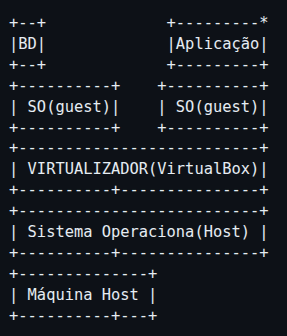
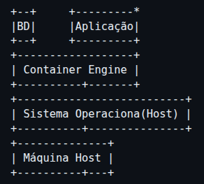

# jornada-tabnews

Todos os conhecimentos adquiridos no curso.dev.

> "Se você quiser fazer uma torta de maçã do zero, primeiro você deve inventar o universo" - Carl Sagan. Ou seja, não é necessário criar todas as coisas que você vai utilizar do zero.

---

## Configurando projeto

### Entendendo nvm

- nvm (Node version maneger)
- nvm ls (Lista as versões do node disponíveis)
- nvm --help (Lista os comandos disponíveis)

### Mudando a versão atual do node:

- nvm install lts/hydrogen
- nvm alias default lts/hydrogen (nvm apelido padrão lst/hydrogen)

### Tecnologias Utilizadas

- Node.js (fundação) -> Next.js (paredes) -> React.js (móveis)

  #### Instalando Tecnologias
  - .nvmrc (Node Version Manager Run Commands)
  - nvm install (Reconhece o arquivo .nvmrc e instala a versão recomendada para rodar a projeto)
  - **npm** (node package maneger)
  - npm init (Cria um package.json para definir os requirements do projeto)
  - npm install next@13.1.5 (@some.version)
  - npm install react@18.2.0 (@some.version)
  - npm install react-dom@18.2.0

  #### next dev (comando next que executa o projeto)
  - o comando resultará um erro pois, no package.json o next é instalado de forma local.
  - Para executar o comando é necessário adiciona-lo no objeto "scripts" de package.json.
  - O comando vai ser executado através do script de package.json, com o comando _npm run dev_.

  ##### terminal:
  - Rodando _npm run dev_.
    > Mensagem de erro: ready - started server on 0.0.0.0:3000, url: http://localhost:3000 , error - Project directory could not be found, restart Next.js in your new directory
    > O servidor levanta, mas cai em seguida pois não existe nenhum conteúdo para ser carregado.

---

## Protocolos

- HTTP: Hypertext Transfer Protocol
  - Como informações web vão ser trocadas entre cliente-servido: requisições e respostas.
  - Como servidores com vistual hosts, ou seja, que servem várias aplicações sabem qual API retornar? Basicamente, no cabeçalho http, o usuário/navegador define o `host` que se quer ser acessado.
- FTP: File Transfer Protocol
- SMTP: Simple Main Transfer Protocol
- TCP: Transfer Control Protol
  - Confirma o recebimento dos pacotes, garantindo sua integridade (+ segurança).
- IP: Internet Protocol
  - Identificador básico de todos os nós da rede.
- UDP: User Datagram Protocol
  - Diferentemente do TCP, o UDP _não_ assegura a transformação
  - _interpolação para compensar a perda de pacotes_
  - Utilizado em chamadas, jogos.

---

## next.js

- File Base Rounting
  - O Next.js utiliza um sistema de arquivos (/app ou /pages) para definir rotas automaticamente.
  - Cada arquivo dentro da pasta representa uma rota no aplicativo.
  - Exemplo(utilizando a pasta pages):

    ```
    pages/
    ├── index.js         →  /
    ├── about.js         →  /about
    └── blog/
        └── [id].js      →  /blog/:id
    ```

  - Em versões mais recentes (Next.js 13+), recomenda-se usar o diretório **`/app`**:
    ```
    app/
    ├── page.js          →  /
    ├── about/
    │   └── page.js      →  /about
    └── blog/
        └── [id]/
            └── page.js  →  /blog/:id
    ```

---

## Mentalidade

- **Faça do desenvolvimento uma jornada prazerosa e que, ao final, impacte alguém.**
- **Experimente fazer dos acontecimentos da sua vida um curso, um momento de aprendizado - levando a vida de forma mais leve e com perpectiva de evolução.**
- **Tecnologia x Negócios: é difícil, mas devemos ter perpectiva dessas duas torres. Essa ampla visão, no contexto de uma empresa, permite resolver problemas de forma mais efetiva e menos conflitosa _pensando no impacto que o sistema fará_!**
- **Tome cuidado quando alguém disser que algo que você faz é um lixo, pois para aquela pessoa realmente pode ser, mas tenha orgulho da sua evolução. Não espere validação das pessoas.**
- Sinta-se confortável com problemas, não existe atalhos para adquirir esse conforto somente experiência e tempo são necessários.
- Código não é esculpido em pedra, a flexibilidade de um código é um fator de qualidade extremamente importante - desenvolvimento orgânico.

---

## Git

- Sistema centralizado x Sistema distribuído.
  - centralizado: a cópia principal está no servidor e as pessoas _reservam_
    um arquivo para ser alterado, impedindo outros desenvolvedores de acessarem antes de um _checkout_ ser feito.
  - distribuído: cada desenvolvedor tem uma cópia do seu projeto na sua máquina, também resolve problemas de merge.

- O git funciona baseando-se em alguns objetos:
  - tree: árvore de pastas que apontam para arquivos.
  - blob (Binary Large Object): conteúdo bruto de um arquivo (comprimido e endereçado).
  - commit(compromisso): snapshot
  - tags: ...

- Estágios que os arquivos passam 0. Untracked: o git ainda não está monitorando aquele arquivo.
  1. Modified: um arquivo já salvo pelo git está modificado.
  2. Staged: área de preparo, será salvo pelo commit.
  3. Commit: Cria-se uma snapshot _imutável_ com as alterações consolidadas (Uma árvore de blobs + metadados).

  ```md
  - Como realmente funciona o git?
    - O git não salva a diferença entre os arquivos, nem muito menos cópias completas.
    - Na verdade, ele só salva snapshots de arquivos que foram realmente modificados!
      - Ao calcular um hash do conteúdo, se tiver o mesmo valor: o arquivo não mudou, logo o ponteiro deve continuar apontando para a versão já salva;
      - Se mudou o ponteiro salva o BLOB desse arquivo no banco e a árvore passa a apontar para o hash desse blob.
  ```

- Comandos
  - git status: mudanças desde o último commit, branch atual.
  - git add
  - git log --oneline
  - git diff
  - git commit --amend (emenda o commit anterior, criando um novo, com outro hash)
    - Ao dar push, resultou no error: `! [rejected] non-fast-forward`, pois o commit reescrito já estava no github.
      opções: merge, rebase, fast-forward only:
    - _pull --merge_ (igual ao git pull padrão): tenta mesclar os commits.
    - _pull --rebase_: aplica os commits locais por cima dos commits remotos.
    - _push --force-with-lease_: push --force com segurança, sem apagar commits mais recente, protegendo o trabalho das outras pessoas.
      se o commit do diretório remoto for igual ao do local, ele faz o push, se não ele é cancelado.
    - _push --ff-only_: branch local está apenas avançando o ponteiro do branch remoto, sem remover, substituir ou reordenar commits, assim ele só muda o ponteiro para frente. **Só é possível se nenhum trabalho ser perdido**.
  - **git commit -am 'add `...`' - adiciona as alterações na stagearea, adiciona o comentário e commita.**
  - git mv atual_name new_name
    - Renomeia o arquivo do sistema;
    - Remove o arquivo antigo do git;
    - Adiciona o novo arquivo no stage area.

  - git branch: lista todas as branchs do sistema.
    - git branch branch-name : cria uma nova branch;
    - git checkout branch-name: altera a vizualização do projeto para branch criada.

---

### Branches

- Nível 1: o comando `git branch branch-name` cria uma cópia do projeto, onde é possível altera-la sem modificar a cópia original;

- Nível 2: os arquivos não são duplicados, a mudança de linhas do tempo ocorre pelo apontamento do commits. Ou seja, se você cria uma nova branch os commits do passado serão iguais aos da branch main, mas os commits do futuro somente pertencerão a nova branch;

- **Nível 3**:
  - uma branch é um objeto que aponta para um commit, assim _o nome de uma branch pode ser visto como um apelido para um commit_;
  - o ponteiro HEAD aponta para o objeto branch, que aponta para o objeto do commit;
  - `nada é duplicado, apenas ponteiros são movidos para diferentes commits`;
  - por fim, o git checkout, ou o git switch, pode ser um comando apenas para trocar o apontamento do HEAD para diferentes commits.

### Estratégias de branching

- **Trunk-based Development (desenvolvimento baseado em tronco)**  
  Nesse modelo, todo o time trabalha a partir de uma única branch principal, normalmente chamada de `main` ou `trunk`. As alterações são pequenas, frequentes e integradas rapidamente.  
  O objetivo é evitar divergências grandes de código e facilitar a integração contínua (CI).

- **Feature Branch (GitHub Flow)**  
  Para cada mudança no sistema — seja um novo recurso ou a correção de um bug — é criada uma branch separada a partir da `main`.  
  Quando o desenvolvimento termina, a branch é revisada e integrada de volta à branch principal.
  - **Pull Request (PR)**  
    É o mecanismo usado para solicitar a revisão do código. Permite comentários, validações automáticas (testes) e aprovação antes do merge, aumentando a qualidade e a segurança das alterações.

- **Git Flow**  
  Estratégia mais complexa, considerada hoje como legado em muitos projetos.  
  Utiliza várias branches fixas, como `develop`, `release`, `hotfix` e `main`, sendo indicada para projetos que precisam manter múltiplas versões em produção ao mesmo tempo.  
  Apesar de organizada, pode gerar mais burocracia e atrasar entregas.

- **Trunk-based Development com Feature Flags**  
  Variação do Trunk-based Development onde funcionalidades novas são integradas diretamente na `main`, mas ficam desativadas por meio de _feature flags_.  
  Isso permite publicar código incompleto sem impactar os usuários finais, ativando ou desativando funcionalidades de forma controlada e segura.
  - Existem várias outras trunk-based development com diferentes features.

---

### Como nunca perder seu código com o git.

- Como deletar branches? `git branch -d branch-name` ou `git branch -D branch-name` para forçar a operação, caso o git solicite um merge;

- Commits apagados podem ser chamados de `dangling commits` ou `unreachable commits`. Por que dangling/unreachable? pois não são alcançáveis por nenhuma referência ativa, ou seja, nenhum commit ou objeto aponta para ele;

- Ao deletar uma branch, o git retorna o **hash do último commit** apontado por esse objeto. Caso essa mensagem seja perdida, é possível recuperar utilizando: `git reflog`, e alguns outros (`log --graph --oneline --decorate --all --reflog`, etc);

- `reflog (reference log)` mantém um registro local das alterações das referências do Git (por padrão, HEAD ou branches e tags);

- **CUIDADO**: dangling commits não ficam salvos para sempre. Após deixarem de aparecer no reflog (geralmente ~30 dias), eles podem ser removidos pelo garbage collector (`git gc`).

- É possível definir um alias com git! Portanto, é possível fazer `git lg` = `log --graph --oneline --decorate --all --reflog`;
  - ```bash
    git config --global alias.lg \
    "log --graph --oneline --decorate --all --reflog"
    ```

- Por fim, para **restaurar** uma branch basta fazer `git checkout -b <branch-name> <commit-hash> `.

---

### Merge

- `git checkout <souce-HEAD>` -> `git merge <target-HEAD>`;
- `fast-forward` (avanço rápido): apenas atualiza a referência da branch para o _target commit_;
- `3-way merge` (mesclagem de três vidas): quando há divergência de conteúdo é necessário resolve-las e commitar a nova referência;

---

## Deploy

- modelo mental _cliente-protocolo(forma de comunicação)-servidor_
- Hospedar: ...
- Fluxo de deploy:
  _Desenvolvedor - github - C.I. - Biuld - Servidor- Cliente._
- Versel.

---

## Orgânico x Impressora 3D

- A forma como a vida é formada: uma célula se multiplica, orgãos são formados e desenvolvem-se até o momento do nascimento.
- Algo impresso de forma automática, sem características artesanais.

---

## Organização de tarefas

- _Fazer muito com pouco_ e **não** _fazer pouco com muito_ - calcular o saldo.
- Níveis de organização de tarefa (gasto energético perceptiv)
  - Nível 1 (baixo saldo energéco): Ser lembrado individualmente - anotar as tarefas em um papel e deixar perto de você.
  - Nível 2 (baixo ''): Ser lembrado em grupo - marcar o progresso.
  - Nível 3 (médio ''): Expandir conhecimento.
  - Nível 4 (muito alto ''): Gerar métricas e mensurar o progresso das pessoas.
- Pouco para muito > muito para pouco.
  - Trabalhar pouco para muita recompensa.
  - ABSTRAIR PROBLEMAS DIMINUI A COMPLEXIDADE E AUMENTA A MOTIVAÇÃO.

# Como fazer seus projetos darem certo?

o sucesso de projetos pessoais baseam-se em dois pilares: moral x técnica.

- moral: ter uma autoestima alinhada, saber que você é capaz de fazer o que é necessário.
- técnica: estudar e aplicar seus conhecimentos técnicos em projetos, compartilhá-los e valorizar feedbacks.

# Milestones e Issues (Marcos e questões)

- Ferramenta do github para abstrair problemas e facilitar o desenvolvimento.

---

# Padronizar código

- Todo mundo tem seu jeito de escrever e, inclusive, de codar, um impressão digital nas linhas dos códigos. Entretanto, estilizar código auxilia no entendimento das outras pessoas e outro contrinbuintes, fazer essa operação logo no início do projeto evitará problemas futuros!
- Existem dois tipos de _formatadores de código_: os **Pré** formatadores e os **Pós** formatadores.
  - **Pré**: formatam enquanto digitamos o código:
    - `.editorconfig` (https://editorconfig.org/): adiciona regras de estilo ao editor para todos que estiverem trabalhando no projeto.

  - **Pós**: aplica a estilização após salvar o código:
    - Prettier (formatador de código): `npm install prettrier -D`
      - adicionando um script no package.json:
        `"lint:check": "prettier --check .",`
        `"lint:fix": "prettier --write ."`

    - O prettier lê o `.editorconfig` e aplica _algumas_ das configurações definidar, lógico, aquelas que não entram em conflito com suas próprias configurações.

---

# DNS (Domain Name System)

- O que é um **domínio**???
  | Parte | Nome Técnico | O que é |
  | :--- | :--- | :--- |
  | **`www`** | Subdomínio | Define o serviço (o "World Wide Web" no caso). |
  | **`alan`** | Nome Registrado | A parte única que você escolheu. |
  | **`.com.br`** | Domínio de Nível Superior | A extensão geográfica e de categoria. |
  | **`alan.com.br`** | Domínio | A identidade central do seu site. |
  | **`www.alan.com.br`** | Endereço (ou Hostname) | O endereço completo para acessar o recurso. |

- Round 1
  - Computadores só se conectam entre si por meio de Ips.
  - DNS seria um grande banco de dados (`servidor dedicado somente para guardar emails`) que armazena o nome do site e, em outra coluna, o ip do servidor desse site.

- Round 2
  - `Recursive Resolver`(Ferramenta de pesquisa do DNS) -> `root servers` (Aponta para os servidores do domínio mais alto: `.com.br`, por exemplo)-> `Top level domain` (Aponta para o servidor realmente detém o domínio) -> `Authoritative Server`(Fonte): retorna o Ip do _Hostname_ buscado.
    - Diagrama:

      ```
      +---------------------+
      |Dispositivo de cliente|
      +----------+----------+
                | 1. Pergunta: Qual o IP de exemplo.com.br?
                v
      +---------------------+
      | **Recursive Resolver**|
      | -Busca de servidor    |
      |     em servidor       |
      +----------+----------+
                | 2. Pergunta: Quem sabe sobre ".br"?
                v
      +---------------------+
      | **Root Server** ( . )|
      +----------+----------+
                | 3. Resposta: Consulte o TLD ".br"
                v
      +---------------------+
      | **TLD Server** (.br) |
      +----------+----------+
                | 4. Pergunta: Quem é o Authoritative Server que guarda "exemplo.com.br"?
                v
      +---------------------+
      | **Authoritative** |
      | **Server** (exemplo.com.br)|
      +----------+----------+
                | 5. Resposta: O IP é 203.0.113.42 (Exemplo)
                v
      +---------------------+
      |**Recursive Resolver**|
      +----------+----------+
                | 6. Resposta Final: O IP é 203.0.113.42
                v
      +---------------------+
      | Dispositivo Cliente |
      +---------------------+
      ```

  - Fully Qualified Domain Name (FQDN): os domínio que usamos diariamente são apenas abreviações como: tabnews.com.br,
    a versão completa seria: tabnews.com.br`.` (root domain).

  - Para acelerar essa buscar temos o **Time To Live (TTL)**: o ip de sites acessados frequentemente ficam salvos no navegador, econômizando tempo de busca nesse ciclo.

# Como **RESGISTAR** um domínio `.com.br`.

- Como se inserir no bando de dados de um TLD (Top Domain Level)?
  - Operadoras de domínios: hostgator.com, registro.br, etc.
  - nic.br -> registro de todos os domínios do Brasil.

---

# O surguimento do `techubufca`

- Enquanto estudava sobre a criação de domínios, me veio na cabeça: "Como eu vou resgitar um domínio sem saber o que eu quero construir?". Bom, eu sabia que o que fosse criado precisaria gerar valor, um local de pessoas com perfil inovador, acolhedor e construtivo. Algo que tenha ligação com a faculdade e com os cursos de tecnologia, que represente união e que seja construtivo para todos (conhecimento e networking). Talvez algo que ligue pessoas de todos os cursos de tecnologia da UFCA e gere uma união para o desenvolvimento de projetos, um `mostruário de trabalhos, um hub de tecnologia: TecHubUFCA (techubufca.com.br)`.
- O que é um hub? `Um hub é um ponto de conexão, o objetivo é criar uma comunidade viva, onde: estudantes da UFCA se conectam, aprendem e criam sistemas juntos`.
- Como fazer isso? Criando uma `estrutura de rede social simples`.

## Estrutura básica:

- Perfis individuais:
  - nome + curso + habilidades;
  - redes sociais;
  - `score de contribuição (inovation-coins 😂) para cada contruibuição open source ou ligação com projetos.`

- Páginas de projeto:
  - pequena descrição;
  - link do github;
  - contato dos responsáveis pelo sistema;
  - integração com API do github: `tarefas abertas: issues`.

- Equipes (snake_case, pet_core, topiket, etc)
  - `Desenvolvimento temático`: jogos, desenvolvimento web, dados, aplicativos, pesquisa, etc.
    Isso permite que novos ingressantes tentem se aproximar da sua área de interesse.

## Como organizar o conteúdo do site?

- Uma página principal com projetos destaque.
- Outra com grupos e suas respectivas áreas de estudo.
- Área de projetos recentes para que novatos não fiquem _escondidos_.

## Como desenvolver um ambiente realmente colaborativo?

- `Criar um estatuto simples da plataforma: "Estamos nesse exato momento contruindo um novo local na internet para quem têm interesse em tecnologia e quer criar maturidade no assunto, vamos nos conectar e contruir projetos de valor concreto para nossa carreira e futuro da comunidade tec da UFCA."`
- Criar um discord, telegram do TecHubUFCA.

---

# Páguina de 'EM CONSTRUÇÃO'

- Teoria Mc Donalds: Uma ideia ruim gera ideias boas.
  (Vamos almoçar? Aonde? - Ninguém sabe. Mas surguiu uma ideia: Vamos no Mc donalds! Se for pra ir no Mc Donals é melhor a gente x, y ou z!)

# Não confie em serviços.

- Corrigindo, não confie que um serviço terá 100% de uptime, é pouco provável e quase impossível que isso aconteça.

---

# PoC vs MVP

- Métodos para evitar trabalho desnecessário e desperdício de tempo, buscar aprovação ou sugestões de direção para um produto que não foi desenvolvido completamente.
- `Formas baratas de confirmar que o que você acredita está certo, após isso encarar o mínimo necessário para que o mundo atribua valor.`
- Proof of Concept (Prova de conceito)
  - Esclarecer para qual caminho, ângulo remar com o projeto.
- Minimum Viable Product (Produto mínimo viável)
  - Fazer o mínimo bem feito, fazer as features básicas e necessárias do sistema.

---

# Proposta de arquitetura e pastas

- `Simples --> Sofisticado`. Algo que nasce complexo, cresce complexo - no caso podemos relembrar sobre o conceito de desenvolvimento orgânico e impressora 3D (_Over engineering_).
- "Clico de vida de um desenvolvedor":
  
  > Um desenvolvedor começa com códigos simples e ruins(_Under engineering_) e, com o passar do tempo, vai melhorando. Entretanto, a complexidade aumenta MUITO (_Over engineering_). Após um ajuste o desenvolvedor encontra um `meio termo, desenvolvendo códigos simples e robustos`.
- A principal característica ou `qualidade de um software` é sobre o quão `modificável` ele é.

## architecture, files, and folders

- Arquitetura: escopo dos componentes e interação entre eles.
  - Uma arquitetura simples com ótima `modelagem` faz o sistema ir longe.

- Arquivos e Pastas: `hierarquia de informação`.

  ```
  . root
  ├── pages
  │   └── index.js
  ├── models
  │   ├── user.js
  │   ├── content.js
  │   └── password.js
  ├── infra
  │   ├── database.js
  │   ├── migrations
  │   └── provisioning
  │       └── staging
  │           └── production
  ├── tests
  ├── imgs
  │   └── image.png
  ├── package-lock.json
  ├── package.json
  └── README.md
  ```

---

# Testes Automatizados

- Ajuda a isolar onde o código está falhando.
- Código que executa outros códigos.
- Identificar `Regressão`.
- Visual e programática (`continuos integration`).
- Tipos de testes automatizados:
  - Pirâmide de testes (raiz):
  ```
    End-To-End (UI)
        |
        V
    Integration (Service, Endpoints, "o que os clientes usam.")
      |
      V
    Unit
  ```
- Endpoints (Ponto, local final)
  - Interface: GUI, o que o usuário vê.
  - API: Interface de programação das aplicações.
    - Os vínculos de informação por baixo dos panos.

## Instalar o test runner

- Existem vários tests runners no mercado, cada um com _diferentes abordagens_.
- `npm install --save-dev jest@29.6.2`.
- `npm test` (o comando foi adicionado nos scripts do sistema).
- `npm test::watch` (comando também salvo nos scripts) - _abre uma janela no terminal onde, de forma monitorada, ao salvar, executa os testes do sistema automaticamente_.

## TDD (Test Driven Development)nt)

- Desenvolvimento Orientado por testes.
- Exemplo de como escrever testes (`calculator.test.js`)
- O TDD é definido por três estágios:
  - RED: escrever o teste que falhará, que espera algo que awind nãio existe;
  - GREEN: faz a implementação concreta, fazendo os testes passarem;
  - BLUE: refatorar o código.

```js
test("One", () => {
  expect(1).toBe(1); // valor gerado dinâmicamente(Softcoded), valo esperado(Hardcoded)
});

test("nomeDoTeste", callbackFunction);
function callbackFunction() {
  console.log("Traditional Function");
}

test("testName", function () {
  console.log("Anonymous Function");
});

test("testName", () => {
  console.log("Arrow function");
});
```

```js
// -------------------------------------------------------------------------
// Atacando o código por todos os lados
const calculator = require("../models/calculator.js");

test("testingSum(2+2)", () => {
  // semelhante ao python: assert sum(2, 2) == 4
  expect(calculator.sum(2, 2)).toBe(4); // Softcoded, hardcoded
});

test("testingSum('2', '2')", () => {
  // semelhante ao python: assert sum(2, 2) == 4
  expect(calculator.sum("2", "2")).toBe("Error"); // Softcoded, hardcoded
});

test("testingSum('2', '2')", () => {
  // semelhante ao python: assert sum(2, 2) == 4
  expect(calculator.sum("2", 2)).toBe("Error"); // Softcoded, hardcoded
});

test("testingSum(2, '2')", () => {
  // semelhante ao python: assert sum(2, 2) == 4
  expect(calculator.sum(2, "2")).toBe("Error"); // Softcoded, hardcoded
});
```

# Versionamento da API

- É possível fazer o versionamento da API pormmeio da cosntrução de rotas, por exemplo `api/v1/status`
- O vercionamento feito acima se baseia no método `GET`, mas também é possivel ser feito com o método `POST`.
- Utilizando o método POST: ...

# Endpoints

- São testes que validam se determinada parte do sistema está integrada. Basicamente uma requisição é feita e, dependendo do código de status respondido no header http, o teste é validado ou não.

## Fetch, await, async function

> Santíssima trindade do Javascript para buscar dados na internet.

- `async function`: avisa ao js que o retorno dessa função não será imediato, deve-se esperar e não travar a aplicação.
  - Define um contexto assíncrono.
  - Só é possível utilizar o comando await se essa função for async.aspectos

- `fetch`: envia o pedido para alguma API, mas, antes, retorna automaticamente uma promessa de que em algum momento terá um retorno.
  - Função utilizadas para requisições http, semelhantes a classes `request do python`, sendo o último de compotamento síncrono.
  - Devolde um `Promise` antes mesmo de solicitgar algo a API.
  - O conteúdo que é retornado e que será realmente utilizado na aplicação é o objeto `Response`, um envelope fechado com dados da resposta do servidor.
  - Utiliza-se o método `.json` para abrir esse envelope e posteriormente consumir essa informações.

- `await`: para a execuçãio da linha até que o fetch traga realmente os dados.
  - pausa o fluxo do código até que fetch retorne algo diferente de um Promise.
  - só é possível utilizar essa palavra-chave se a função for async.

---

# Como escolher um banco de dados?

- Para a resolução de um bancon de dados é necessário fazer a escolha desses três aspectos do sistema: `SGDB`(Sistema de Gerenciamente de Banco de Dados), `Query`(consultas), `Migrations`.
- **Características de banco de dados**: relacional, não relacional(armazenamnete de documentos, armazenamento de chave-valor), série temporal, espacial.
  - **Principal**: SQL x NoSQL (_Structured Query Language_)

- **SGDB**: `Para o projeto vamos utilizar o **PostgreSQL**.`
- **Query**: `pg.` -`ORM (Object-Relational Mapping): camada de abstração no banco de dados, utilizado para fazer consultas utilizando métodos e funções.`
  - _sequelize_.
  - Vamos fazer todas as consultas na mão!

- **Migrations**: `node-pg-migrate.`
  - arquivo que instrui modificações no banco de dados, versionamento de tabelas, controle de modificações.

---

# Docker

> Antigamente a dificuldade de subir num banco de dados ou aplicação era enorme, pois os programas eram muito sensíveis a "divergências" no sistema operacional das máquinas (Hardware, antivírus, configurações gerais, aplicativos instados) causava conflito com o computador Hosts. > Na minha máquina roda!!!

> Podemos pensar em algo semelhante aos celulares: existêm vários smatphones android com configurações e modificações de sistema diferêntes, dependendo da fabricante. E, bom, cada aplicativos tem que se adequar a rodar nessa variedade de dispositivos - o que causa erros, diferenças de desempenho, etc.

> Para resolver esse problema foram desenvolvidas as máquinas virtuais, que simulavam a instalação de um sistema operacional em uma parte desconexa do sistema, ocupando MUITA memória e processamento!

- 

> É uma longa história até o desenvolvimento do `Docker`, que permite o isolamento total de processos, em 'containers', por meio do kernel(namespaces ou cgroups) do sistema operacional(Linux), sem precisa de várias virtual machines.

- 

> O que é um `container`? **Ele não é uma máquina virtual!** Conjunto de dependências (binários e bibliotecas) _isolados a nível de processo_ que são executados pelo kernel do sistema operacional.

---

## Docker-compose

- `docker --version`.
- `docker-compose --version`.
- `compose.yaml`

```
+------------+
| Dockerfile |
+------------+
- Código fonte que define instruções (sistema operacional, versão) que vão formar um ambiente base;
- `Receita da aplicação`.
    |
    V
+-------+
| image |
+-------+
- Intruções compiladas;
    |
    V
+---------+
|container|
+---------+
- processo míninmo e isolado que executa as intruções da imagem.
```

- É possível baixar uma imagem do postgres pelo dockerhub (repositório de imagens).
- Após configurar o arquivo `compose.yaml`, executei o comando `docker compose up` para instalar as depêndecias definidas.
- "Compreender problemas, também é conhecimento."
- `docker ps --all`
- `docker logs <container-name>`
- detached ("separado"): `docker compose up -d`
  - como se executasse em segundo plano os processo do container, liberando o terminal.

- psql: instalando o postgres client: `sudo apt install postgresql-client`, assim é possível executar
  - `psql --host=localhost --username=postgres --port=5432`, aconteceu um erro: ainda não existe uma porta para o cliente. Para criar a porta foi definido arquivo compose instruções para portas ("host:container" -> "host:container"). Após isso é preciso reconfigurawr o container:
    - destruir container: `docker compose down` -> `docker compose up` ou `docker compose up -d --force-recreate` (faz os dois ao mesmo tempo). Por fim foi possível entrar no ambiente `postgres=#`.

    ```sql

      postgres=# SELECT 1+1;
       ?column?
      ----------
              2
      (1 row)

    ```

    - como o arquivo compose foi movido para o diretório intra/ será necessário ajustar o comando para incializar o container: `docker compose -f infra/compose.yaml up`.
    - _Existem formas de simplificar essa inicialização com scripst npm._
      > Modifiquei os scrips, agora basta rodar: `npm run container:init`, `npn rum postgres`.

---

# database.js

- Primeiramente ele foi importado para a páguina de status, após isso foi inserido:

  ```js
  // Objeto literal, não um json. Ele chama métodos/funções, não texto puro(como um json).
  export default {
    query: query, // chave:valor
  };
  ```

  - O que diabos isso faz? Bom, inicialmente define um objeto padrão de exportação { query:query, }. Mas, afinal, o que é esse objeto? É um objeto Javascript que exporta métodos/funções.
  - Agora no index.js que importou esse objeto:
    ```js
    import db from "../../../../infra/database.js";
    // como o objeto não é nomeado(na verdade, por conta do modelo de exportação ser 'export default' objeto pode receber um apelido),
    //  é literal, quem difene seu nome é quem o exporta.
    ```

---

# Variáveis de ambiente

- Stateless("Sem estado"): mover a camada de persistência para um outro local, deixando o backend só com as regras de negócio.
  - O backend vira uma máquina pura, só executa código.
  - Atualmente as credênciais estão hardcoded, fazendo com que o backend não esteja stateless, se o código for clonado para outro contexto o database local continuará sendo a persistência, para todos os clones:
    ```js
    const client = new Client({
      host: "localhost",
      port: 5432,
      user: "postgres",
      database: "postgres",
      password: "local_password",
    });
    ```
  - Para deixar isso mais flexível é preciso definir as variáveis de ambiente.

  - `POSTGRES_PASSWORD=local_password npm run dev`.
    Esse comando define, no env do terminal, a variável de ambiente `POSTGRES_PASSWORD`, apenas para o processo que for rodado **em seguida**: `npm run dev`. Essa não é a melhor forma de se fazer.
  - **DICA**: Para digitar algo sensível no terminal basta fazer: ` ...command...`.
    (espaço comando)

  - `dotenv`: carrega as variáveis de ambiente definidas em um arquivo `.env`(na raiz do projeto) no objeto js `process.env`.
    - O next.js recomenda que o arquivo _.env seja commitado_, mas a documentação do dotenv recomenda que _não deve ser commitado_.
      A vercel aplica o contrário da documentação do módulo, pois, durante o deploy, é possível definir variáveis de ambiente na plataforma, sobrescrevendo o arquivo .env "local".

  - `Por que renomear o arquivo .en para .env.development?` É uma forma de `organizar e separar as variáveis de ambiente por contexto.`
    - `.env.development`: desenvolvimento local;
    - `env.production`: produção, ou seja, quando está rodando para usuários finais;
    - `env.test`: testes automatizados (banco de dados dedicado a testes);
    - `env.staging`: homologação, validação da aplicação.

  - E se eu commitar um arquivo com dados sensíveis/confidenciais? `git filter-repo`, trocar senhas, apagar chaves de api.

---

# Absolute Imports

- `app-root-path`(encontra a pasta node_modulos e volta uma camada, encontrando a root do projeto);
- `jsconifg.json`(a presença desse arquivo em um diretório indica que aquele diretório é a raiz do javascript-project);
- `tsconifg.json`(a presença desse arquivo em um diretório indica que aquele diretório é a raiz do typescript-project).

```json
// "compilerOptions": jsconig.json é descendente do tsconfig.json (Typescript é complilado!)
{
  "compilerOptions": {
    "baseUrl": "." // indica que a raiz do projeto é o diretório atual(`.`simboliza o dir atual, `..` o anterior)
  }
}
```

---

# Querys parametrizadas

> Segundo a documentação node-postgres: Se estiver passando parâmetros de consulta, evite **concatena-los** diretemente no texto da consulta. Isso frequentimente leva a vulnerabilidade de `SQL injections`.

```js
/* 
Forma `segura` de estruturar consultas com um objeto `query`. 
- A query é pré-compilada pelo banco, ou seja, o banco separa o comando SQL dos dados:
  - Valida a código de consulta, recebido anteriormente;
  - Trata dados como dados, não como código SQL.
*/
const query = {
  text: "INTER INTO users(name, email) VALUES($1, $2) RETURNING *",
  values: ["Alan Mendes Vieira", "alan.mendes@aluno.ufca.edu.br"],
};

// Forma vulnerável

// input malicioso
const name = "'; DROP TABLE users; --";
const email = `INSERT INTO users(name) VALUES('${name}')`;

const invalid_query = `INSERT INTO users(name, email) VALUES ('${name}', '${email}') RETURNING *`;

// Outra forma de formatar essa string
const invalid_query =
  "INSERT INTO users(name, email) VALUES ('" +
  name +
  "', " +
  email +
  "') RETURNING *";
```

---

# Opções de hosteamento por terceiros

- É uma escolha MUITO válida dentro de um contexto real onde manter um serço rodando de forma integral é um desafio (90% das aplicações utilizam esse método).
- Estou utilizando `Neon` para realizar a tarefa de hospedar o banco de dados.
- No curso foi apresentado outra ferramenta: `DigitalOcean`, que é paga. E nela temos algumas especificidades: além do SSl requerido, é preciso ter uma validação de certificado.
  - `Self-signed certificate (Certificado Autoassinado)`.
  - EXPLICAÇÃO DE NÍVEL 1:
    O protocolo TCP valida e confirma conexões entre servidores como seguras por meio de um certificado. Ao utilizar o serviço da DigitalOcean, **o certificado é gerado e assinado pela própria digitalOcean**.
    Isso é identificado como um problema pelo node.js, que espera um certificado gerado por uma autoridade terceira - geralmente são informações que já vem com o sistema operacional. Como o certificado da DigitalOcean não faz parte dessa lista, o Node.js o identifica como potencialmente inseguro.
    Para resolver esse problema, **é necessário informar ao Node.js o certificado raiz gerado para seu usuário na plataforma**, isso é feito por meio da variável de ambiente : `POSTGRES_CA`, encaminhado na configuração SSL da conexão com o banco.

---

# Migrations

> Um projeto que não utiliza migrations é semelhante a um que não utilizar o git.

- Banco de dados
  - Estruturas de um banco de dados: linhas + colunas = `tabela`.
  - Uma grande diferença entre uma tabela de excel e um banco de dados relacional é a `tipagem de dados`.
  - Diferenças dos bancos entre os ambientes de desenvolvimento.

- `Database Schema Migrations` é uma forma de fazer alterações no schema de um banco de forma manual, transformando em código.
  - Possibilitam o versionamento do `schema` do banco de dados e processos relacionados a essa possibilidade;
  - Essa ferramenta é sustentada por dois pilares:
    - `Arquivos de migração` (Ordem, alterações);
    - `Framework de migração` (Ordem, uma única vez).

- `Framework para migrations`: node-pg-migrate;
  - Arquivos migrations criados utilizam `unix timestamp` para definir _ordem de execução_;
  - Armazenam as `Diffs` definidas em todas as migrações, rodando em sequência todas as migrations.
  - E quanto eu tenho um schema/banco que tá no meio das migrations?
    - Dentro do banco existe uma tabela interna com as migrations que já foram aplicada, assim são apĺicadas apenas as que faltam.
  - Ferramenta de linha de comando, verifique o package.json para vizualizar o comando original.
  - Por padrão, o framework procura as credênciais do banco de dados no objeto `process.env.DATABASE_URL`, onde obviamente essa informação deve estar definida no arquivo `.env`.

  - `DATABASE_URL` atualmente está hardcoded no arquivo `.env.development`, para resolver o problema de interpolação, foi necessário adicionar o `dotenv-expand` no projeto.

- Desenvolvimento do endpoint `/migrations`:
  - GET: Dry run
  - POST: Wet run
  - Direction : up x down
    - Roll*back* (reverter) x Roll*forward* (avançar)
      - > Why rollback when you can rollforward? - How we make deploys? - StackOverflow 2016.
  - Limpar o banco para que os testes sempre partam do mesmo contexto!
    - GarbageDB x Transaction
    - É preciso rodar os testes de forma serial para evitar erros: `jest --runInBand` - Aumentando a confiabilidade do teste!
    - _O Jest@10.8.2 não suporta o `ECMAScript Modules (ESM)`! Diferente mente do next.js,
      que utiliza um compilador `swc` para transpilar seu código moderno, para versões anteriores.
      Além de muitas outras configurações fornecida pelo next.js._ - Vamos fornecer os recursos do next.js para o Jest por meio do jest.config.js - arquivo de configuração especial.
      - **Desafio 1**: provar que o jest de fato está rodando no ambiente de testes, env.development não são carregas.

      ```js
        test("GET to /api/v1/migrations should return 200", async () => {
        // Desafio 1 - completo
        const q = await db.query("SELECT 2+2;");
        console.log(q);
        // Essa é uma tentativa de fazer uma query no banco, o que com certeza
        // está acontecendo é que process.env.NODE_ENV está retornando true, já
        // que test != development.

        /*
        FAIL tests/integration/api/v1/migrations/get.test.js
        ● Console

        console.log
        test

            at log (infra/database.js:44:11)

            --- Esse log comprova a hipótese!

        */
          console.log("🔍 NODE_ENV:", process.env.NODE_ENV);
          console.log("🔍 DATABASE_URL:", process.env.DATABASE_URL);
          console.log("🔍 POSTGRES_PASSWORD:", process.env.POSTGRES_PASSWORD);

        /*● Console

        console.log
          🔍 NODE_ENV: test

          at Object.log (tests/integration/api/v1/migrations/get.test.js:15:11)

        console.log
          🔍 DATABASE_URL: undefined

          at Object.log (tests/integration/api/v1/migrations/get.test.js:16:11)

        console.log
          🔍 POSTGRES_PASSWORD: undefined

          at Object.log (tests/integration/api/v1/migrations/get.test.js:17:11)*/

      ```

      - **Desafio 2**: conseguir carregar essa variáveis no banco de dados.
        - `O Jest define por padrão o seu NODE_ENV = 'test', o que implica que ele não vai acerssar as variáveis de ambiente definidas em .env.development`.
          Consigo enxergar duas possibilidades para solução desse problema: criar uma cópia de .env.development como .env.test, ou definir em jestconfig que ele utilize o ambiente 'development'.
        - Bom, seguindo a convenção vou aplicar a primeira solução. Até porque será possível criar um banco próprio para testes!

---

# Homologação / Staging / Preview

- Se uma nova branch for criada e enviada para o github a vercel faz o deploy de forma automática;
  - Utilizando a estrutura da vercel, o deploy é feito de feito de forma idêntica para diferentes ambiente. Digo, não existe diferença de deploy entre homologação e produção, o que realmente vai diferir os dois são as variáveis de ambiente.

---

# Continuous Integration (CI)

- Primordialmente, o fluxo de desenvolvimento era realizado em forma de cascata (requisitos -> projeto -> implementação -> validação -> implantação), mas isso mudou com o surguimento da `Metodologia Ágil`:

  > "Estamos descobrindo maneiras melhores de desenvolver
  > software, fazendo-o nós mesmos e ajudando outros a
  > fazerem o mesmo. Através deste trabalho, passamos a valorizar:

  > **Indivíduos e interações** _mais que processos e ferramentas_
  > **Software em funcionamento** _mais que documentação abrangente_
  > **Colaboração com o cliente** _mais que negociação de contratos_
  > **Responder a mudanças** _mais que seguir um plano_

  > Ou seja, mesmo havendo valor nos itens à direita,
  > valorizamos mais os itens à esquerda."

- `Posteriormente`, por meio do Manifesto Ágil, a cultura ágil foi implementada no meio de desenvolvimento de software e como consequência de sua radicalização, `o que deveria ser uma estrutura saudável se tornou um produto`. O desgaste da metodologia ágil cuminou com o movimento `"Morte ao ágil"`, que questionáva a aplicação errônea da metoodologia: `as empresas passaram a focar excessivamente nos itens à esquerda do manifesto, descartando quase completamente princípios organizacionais básicos e fundamentais, representados pelos itens à direita.`

- `Integração contínua`: estruturação do ciclo de desenvolvimento baseando-se em sprints, ciclos de poucos dias entre a evolução do sistema e a velidação com o cliente;
  - Para implementação desses novos fluxos de trabalho foi necessário `automatizar` _partes_ do desenvolvimento de software por meio de linguagens compiladas, testes automatizados, controle de versão, etc;

  - **CD** (Continuous integration/Continuous Delivery): depois de toda a validação o CD fica responsável pela automatização do processo de deploy da aplicação;

  - **CA/CD**: como os dois estão muito relacionados, um conceito acompanha o outro;

  - Essas automatizações também previnem downtimes ocasionados por erro humano.

- `Continuous Integration -> Continuous Delivery -> Continuous Deployment`;
  - O CDeployment automatiza ainda mais o deploy: se os processos anteriores ao deploy foram finalizados, ele é feito de forma automática;
  - `Robozinho da vercel`.

  ***

  ### Race Condition
  - Situação onde dois ou mais processos tentam acessar um recurso ao mesmo tempo.

  ***

  ### Estabilizar Ambiente Local
  - npm rum dev` passa rodar as migrations por meio de um script recursivo que valida se a conexão está disponível ou não (`docker exec postgres-dev pg_isready --host localhost`);
  - Após a implementação básica eu refatorei utilizando o módulo `cli-spinner` para adicionar um loading mais visual, e por recomentadação da ia eu utilizei a função `setTimeout()` para fazer a recução de forma assíncrona.

  ***

  ### Estabilizar Teses Locais
  - `npm run test` inicializa o banco, o servidor e executa os testes;
  - `Orchestrator`: modelagem da infroestrutura dos testes;

  - Versão que eu implementei:

    ```js
    async function waitForAllServices() {
      await waitForWebServer();

      async function waitForWebServer(maxRetries = 10, delay = 500) {
        for (let i = 0; i < maxRetries; i++) {
          try {
            const response = await fetch("http://localhost:3000/api/v1/status");
            const data = await response.json();

            if (data && response.status === 200) {
              return;
            }
          } catch (error) {
            if (i === maxRetries - 1) {
              throw new Error(
                "Server não respondeu após multiplas tentativas.",
              );
            }
            await new Promise((resolve) => setTimeout(resolve, delay));
          }
        }
      }
    }
    ```

  #### DÚVIDA: _por que utilizar o módulo `concurrently` para rodar o next e jest_?
  - Primeiramente, rodar processos de forma concorrente é sinônimo de roda-los de forma paralela? Definitivamente não, são formas bem distintas de rodar processos:
    - **Concorrência**: as tarefas **progridem** ao mesmo tempo, sendo executadas **simultaneamente** no mesmo CPU;
      - ```md
        Tarefa A: ████░░░░████░░░░
        Tarefa B: ░░░░████░░░░████
        ─────────────────► tempo
        (mesma CPU alternando)
        ```

    - **Paralelismo**: as tarefas executam ao **mesmo tempo**, em CPUs diferentes;
      - ```md
        CPU 1: ████████████████
        CPU 2: ████████████████
        CPU 3: ████████████████
        CPU 4: ████████████████
        ─────────────────► tempo
        (execução simultânea real)
        ```

    - Por fim, sanando a dúvida: O `next dev` **nunca termina** - ele fica rodando o servidor indefinidamente. Então o Jest nunca seria executado!
      Assim, rodando **concorrentemente**, ambos ficam ativos ao mesmo tempo e quando os testes terminam o servidor é fechado.

  ***

  ### Estabilizar CI
  - github actions: é uma **integração** do github que permite **automatizar fluxos de trabalho** (CI/CD);
    - Para utilizar a ferramenta basta criar um diretório `.github/workflows` na raiz do projeto, essa pasta deve conter um arquivo `.yaml` que configura o processo;
    - DÚVIDA: Qual a diferença entre utilizar `npm install` x `npm ci`?
      1. `npm ci`: utiliza **apenas** as dependências do `package-lock.json` (_falha se não existir o arquivo no diretório_);
      2. `npm install`:
      - **SE** o `package-lock.json` existir no diretório (_e está consistente com o package.json_) instalará as versões exatas presentes no arquivo,
        - no caso de existir inconsistências entre os arquivos, o npn resolve as dependencias e atualiza o lock.
      - **SENÃO** instalará as versões dentro do range descrito no `package.json` ("^18.1.3" - > 18.x.x);
      3. Para atualzar todas as dependências do projeto: `npm update`.

      No geral, o `npm install` é utilizado para instalar/adicionar as dependências do projeto (desenvolvimento local) e, no ambeinte de produção/CI utiliza-se o `npm ci`.

  ***
  1. O primeiro `workflow` adicionado foi o `test.yaml` que é responsável proi rodar os testes durante o deploy;
  2. O segundo, `linting.yaml`, ficou responsável por verificar a `estilização do código`;

  ***
